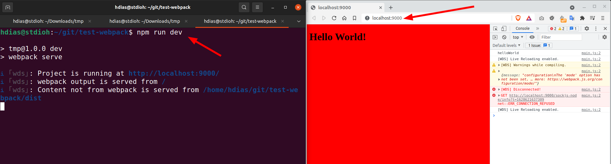
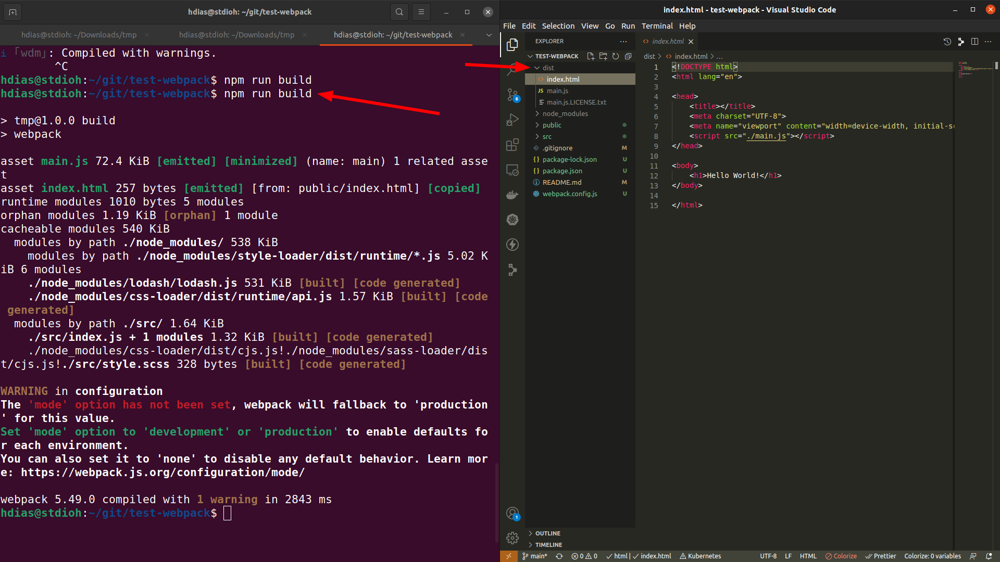

# test-webpack
Test Webpack

# Requirements
1. [Node/NPM](https://nodejs.org/pt-br/download/)
 

# Setup

```sh
npm i
```

# Run 
```sh
npm run dev
```
|Run Dev|
|:---:|
||
# Build
```sh
npm run build
```
|Build|
|:---:|
||


Open your browser at:

http://localhost:9000


# References
* [Youtube tutorial](https://www.youtube.com/watch?v=5IG4UmULyoA)